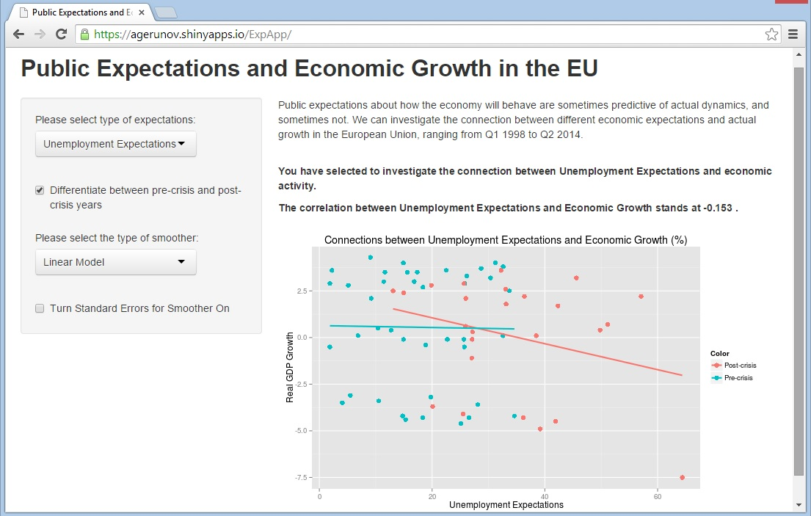

## Expecting The Unexpected

 "...we devote our intelligences to anticipating what average opinion expects the average opinion to be." - J.M. Keynes (a pretty smart economist)

 

**Through the power of Shiny and ExpApp, we can now do that easily!**

---

## Looking at Data

* Public Expectations show how the people feel about the economy

* This sometimes **correlates to how the economy behaves**, and always influences it

* Strongly held beliefs can sometimes turn into self-fulfilling prophecies

* The **ExpApp allows** you to follow how these public expectations are associated with output (or real GDP) growth in the EU from 1998 to 2014

* The app lets you explore **different types of expectations**, different ways of showing the trend and can even distinguish between the pre-crisis (Q1.1998-Q2.2008) and post-crisis (Q2.2008 onwards) 

---

## A Thousand Words

* The ExpApp uses gglot2 **visualization to show you the association** between expectaions and growth

```{r, echo=FALSE}
library(ggplot2)
expdata <- read.csv("expdata.csv")
```

```{r, echo=TRUE}
qplot(x=as.numeric(expdata$ovcond), y=as.numeric(expdata$rgrow), 
                xlab="Overall Expectations", ylab="Real GDP Growth", size=I(3)) + geom_smooth(method=lm, lwd=1)
```    

---

## Changing Minds

* The App also lets you see how the **connections differ before and after the economic crisis** in the EU (started 2008)

```{r, echo=FALSE}
Color <- expdata$crisis
```

```{r, echo=FALSE}
qplot(x=as.numeric(expdata$ovcond), y=as.numeric(expdata$rgrow), color=Color,
                xlab="Overall Expectations", ylab="Real GDP Growth", size=I(3)) + geom_smooth(method=lm, lwd=1)
```

---

## Your Digital Edge

* Explore all this and more online! Go to the [ExpApp webpage](https://agerunov.shinyapps.io/ExpApp/).

